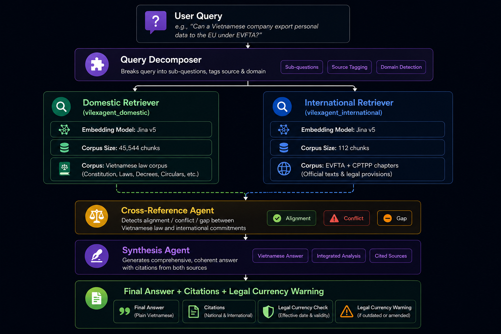

# ViLexAgent ⚖️

**A Multi-Agent Retrieval-Augmented Generation System for Vietnamese Regulatory Compliance Question Answering**

ViLexAgent is an agentic RAG system purpose-built for complex Vietnamese legal and regulatory queries. It combines a role-specialized multi-agent pipeline with a dual-corpus knowledge base covering domestic Vietnamese legislation and international trade agreements (EVFTA, CPTPP), enabling cross-document reasoning that single-agent RAG systems cannot perform.

---

## Demo

<p align="center">
  <a href="https://youtu.be/NiSOUBOXjiU">
    
  </a>
</p>

<p align="center">
  Click the image above to watch the full demo
</p>

```
Query: "Việt Nam có đáp ứng các tiêu chuẩn lao động của CPTPP về tự do hiệp hội không?"

💭 Thought
  🔍 Phân tích câu hỏi     → 4 sub-questions (domestic + international)
  📚 Tra cứu pháp luật VN  → 10 văn bản (Luật Công đoàn, Bộ luật Lao động...)
  🌐 Tra cứu quốc tế       → 8 điều khoản (CPTPP Ch.19, EVFTA Ch.13)
  ⚖️ Đối chiếu pháp luật   → ❌ Mâu thuẫn
  ✍️ Tổng hợp câu trả lời  → 3,039 ký tự

Answer: Việt Nam hiện chưa đáp ứng đầy đủ...
```

---

## Architecture

<p align="center">
  
</p>

---

## Evaluation Results (30 questions)

### General Metrics

| System | Error Rate | Avg Latency |
|---|---|---|
| Baseline1 NaiveRAG | 0% | 3.53s |
| Baseline2 RAG+Rerank | 0% | 3.85s |
| **ViLexAgent** | **0%** | **5.43s** |

### Tier 1 & 2 — Agentic Metrics (ViLexAgent only)

| Metric | Score |
|---|---|
| Decomposition Schema Pass Rate | **100%** |
| Expired Document Warning Rate | **100%** |
| Citation Grounded Rate | **80%** |
| Source Routing Accuracy | **80%** |
| Alignment Accuracy (Type C) | **70%** |
| Keyword Coverage | 0.64 |

### Tier 3 — Response Quality (1–5 scale, LLM-as-Judge)

| System | Relevance | Groundedness | Completeness |
|---|---|---|---|
| Baseline1 NaiveRAG | 4.43 | 2.73 | 3.93 |
| Baseline2 RAG+Rerank | 4.43 | 3.27 | 4.07 |
| **ViLexAgent** | **4.43** | **4.47** | 3.83 |

**Key findings:**
- ViLexAgent achieves **4.47/5 groundedness** — 64% better than Baseline1 and 37% better than Baseline2, demonstrating the multi-agent architecture's effectiveness at grounding answers in retrieved legal sources.
- All three systems score equally on relevance (4.43), confirming the quality gap lies in faithfulness and grounding, not answer relevance.
- The latency trade-off is modest: **5.43s vs 3.53s** — a 54% increase in exchange for dramatically improved legal accuracy and citation grounding.
- 100% expired document warning rate ensures users are never misled by outdated legislation.

---

## Tech Stack

| Layer | Tool |
|---|---|
| Agent Orchestration | LangGraph 1.1.10 |
| UI | Chainlit 2.11.1 |
| LLM | Gemini 2.5 Flash (or any models you like) via FreeLLMAPI |
| Embeddings | Jina v5 text-small (1024-dim) |
| Reranker | BGE-Reranker-v2-M3 |
| Vector DB | Qdrant (local Docker) |
| Experiment Tracking | MLflow |
| Logging | Loguru |
| Containerization | Docker Compose |

---

## Project Structure

```
vilexagent/
├── app/
│   └── vilexagent_ui.py        # Chainlit UI
├── src/
│   ├── agents/
│   │   ├── state.py            # LangGraph AgentState
│   │   ├── query_decomposer.py # Node 1: query decomposition
│   │   ├── domestic_retriever.py  # Node 2: Vietnamese law retrieval
│   │   ├── international_retriever.py  # Node 3: EVFTA/CPTPP retrieval
│   │   ├── cross_reference.py  # Node 4: conflict detection
│   │   ├── synthesizer.py      # Node 5: answer generation
│   │   └── graph.py            # LangGraph pipeline
│   ├── ingestion/              # Data pipeline scripts
│   ├── retrieval/
│   │   └── baseline.py         # Baseline retriever for evaluation
│   └── utils/
│       ├── llm.py              # FreeLLMAPI singleton
│       ├── model_loader.py     # Jina v5 singleton
│       └── logger.py           # Loguru configuration
├── evaluation/
│   ├── benchmark.json          # 30 questions (Type A/B/C)
│   ├── build_benchmark.py
│   ├── run_evaluation.py       # 3-system evaluation pipeline
│   └── results/final_eval/     # Full evaluation results
├── data/
│   ├── raw/                    # Downloaded corpora
│   └── processed/              # Parsed chunks
├── docker/
│   └── docker-compose.yml      # Qdrant + MLflow
└── tests/
    ├── test_decomposer.py
    └── test_retrievers.py
```

---

## Prerequisites

- Python 3.13+
- Docker Desktop (for Qdrant and MLflow)
- NVIDIA GPU with CUDA 12+ (for Jina v5 embeddings on GPU)
- Node.js 20+ (for FreeLLMAPI)
- Google AI Studio API key (free at aistudio.google.com)

---

## Setup

### 1. Clone and install dependencies

```powershell
git clone https://github.com/dnAnh1523/vilexagent.git
cd vilexagent
poetry install
```

### 2. Configure environment

Copy `.env.example` to `.env` and fill in:

```env
GOOGLE_API_KEY=your_gemini_api_key
FREELLM_API_KEY=your_freellmapi_unified_key
FREELLM_BASE_URL=http://localhost:3001/v1
QDRANT_URL=http://localhost:6333
MLFLOW_TRACKING_URI=http://localhost:5000
```

### 3. Start infrastructure

```powershell
docker compose -f docker/docker-compose.yml up -d
```

### 4. Start FreeLLMAPI (LLM proxy)

```powershell
# In a separate terminal
cd E:\freellmapi
npm run dev
# Open http://localhost:5173 and add your Google API key
```

### 5. Build the corpus (first time only)

```powershell
# Download Vietnamese legal documents
poetry run python -m src.ingestion.acquire

# Filter, parse, and chunk
poetry run python -m src.ingestion.filter
poetry run python -m src.ingestion.join
poetry run python -m src.ingestion.parse

# Download international chapters (EVFTA, CPTPP)
poetry run python -m src.ingestion.acquire_international
poetry run python -m src.ingestion.parse_international

# Embed and index into Qdrant
poetry run python -m src.ingestion.embed_and_index
poetry run python -m src.ingestion.embed_international
```

**Note:** Embedding 45,544 chunks takes ~1.5 hours on an RTX 3050. The Qdrant volume persists between restarts — you only need to do this once.

### 6. Verify setup

```powershell
poetry run python -m src.verify_setup
```

### 7. Run the UI

```powershell
poetry run chainlit run app/vilexagent_ui.py --port 8000
```

Open `http://localhost:8000`.

---

## Running Evaluation

```powershell
# Run 5-question pilot
poetry run python -m evaluation.run_evaluation

# Run full 30-question evaluation
$env:EVAL_MAX_QUESTIONS=30
poetry run python -m evaluation.run_evaluation
```

Results are saved to `evaluation/results/` and logged to MLflow at `http://localhost:5000`.

---

## Corpus Details

| Corpus | Source | Documents | Chunks |
|---|---|---|---|
| Vietnamese domestic law | vbpl.vn (HuggingFace dataset) | 8,596 | 45,544 |
| EVFTA chapters | thuvienphapluat.vn + trungtamwto.vn | 2 chapters | 52 |
| CPTPP chapters | mfat.govt.nz | 2 chapters | 60 |

**Domains covered:** Labor law, Food safety & SPS measures

**Legal basis for use:** Vietnamese legal documents are public domain under Law on Access to Information (No. 104/2016/QH13) and Law on Promulgation of Legal Documents (No. 64/2025/QH15).

---

## Key Design Decisions

**Article-level chunking:** Legal documents are split at article boundaries (`Điều X`) rather than fixed token counts, preserving legal meaning across chunk boundaries.

**Two-model embedding strategy:** Domestic Vietnamese law uses Jina v5 (Vietnamese-capable, 1024-dim). International documents use the same model for cross-lingual alignment, stored in a separate Qdrant collection to enforce retrieval isolation.

**Legal Currency Score:** A custom metric that flags answers citing expired (`Hết hiệu lực`) legislation. The system achieves 100% warning rate — every answer referencing expired law explicitly notifies the user.

**FreeLLMAPI proxy:** All LLM calls route through a local OpenAI-compatible proxy aggregating free tiers from Google, Groq, Cerebras, and Mistral, providing automatic failover and ~1B tokens/month capacity at zero cost.

---

## Limitations

- **Alignment accuracy:** Cross-reference agent achieves 70% accuracy on Type C (cross-corpus) questions. Primary failure modes: ambiguous `conflict` vs `gap` distinction in the prompt, and retrieval of expired domestic documents distorting cross-reference reasoning.
- **Latency:** Average 20s per query due to multi-agent pipeline. Not suitable for real-time applications without optimization.
- **Corpus coverage:** Limited to labor law and food safety domains. Other regulatory areas (IP, customs, taxation) are not covered.
- **GraphRAG:** The 897,890-record cross-document relationship graph (amendment chains, citation networks) was downloaded but not integrated. Planned as future work.

---

## Future Work

- GraphRAG integration using the existing relationship graph for amendment chain traversal
- Expand corpus to IP law (CPTPP Chapter 18) and customs (RCEP)
- Fine-tune Jina v5 on Vietnamese legal domain for improved retrieval precision
- Streaming responses in the Chainlit UI
- Reduce latency via parallel agent execution

---

## Citation

If you use this work, please cite:

```
@mastersthesis{vilexagent2026,
  title     = {ViLexAgent: A Multi-Agent Retrieval-Augmented Generation System
               for Vietnamese Regulatory Compliance Question Answering},
  author    = {Do Nhat Anh},
  year      = {2026},
  school    = {THAI NGUYEN UNIVERSITY OF INFORMATION AND COMMUNICATION TECHNOLOGY}
}
```

---

## License

MIT License. See `LICENSE` for details.

Vietnamese legal documents used in this project are public domain under Vietnamese law.
